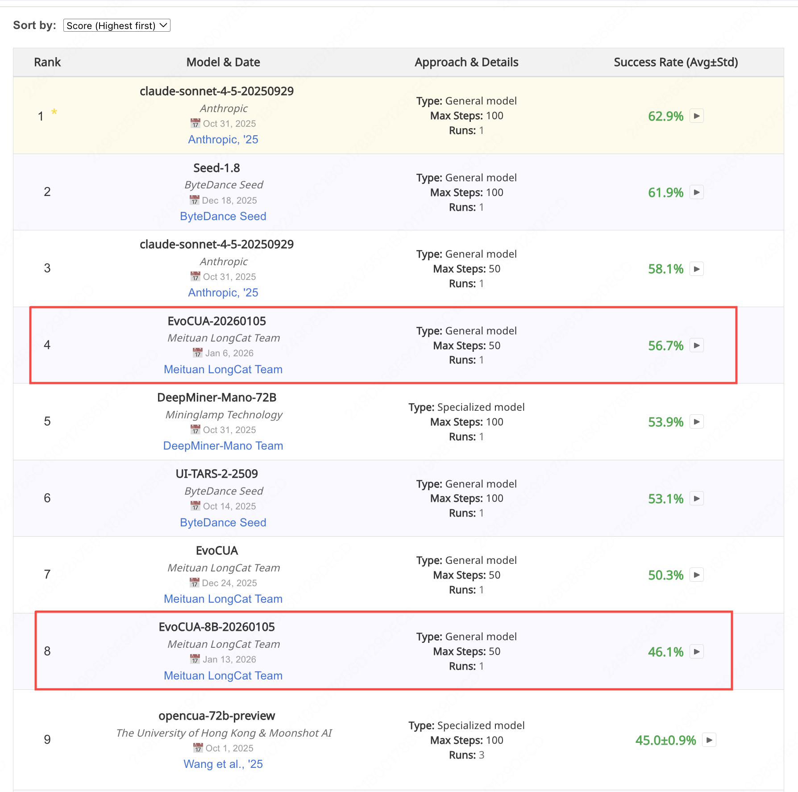

<div align="center">

# EvoCUA: Evolving Computer Use Agent

**🥇 #1 Open-Source Model on OSWorld | A General-Purpose Multimodal Model Excelling at Computer Use**

[](https://huggingface.co/meituan/EvoCUA-32B-20260105)
[](https://huggingface.co/meituan/EvoCUA-8B-20260105)
[](https://os-world.github.io/)
[](./LICENSE)

[English](./README.md) | [中文](./README_CN.md)



**🥇 #1 Open-Source Model on OSWorld Leaderboard (Jan 2026)**

</div>

---

## 📢 Updates
- **2026.03.31**: EvoCUA-32B achieves **56.48%** on WindowsAgentArena (WAA), surpassing UI-TARS-2 by ~6 points — demonstrating strong zero-shot cross-OS generalization 🆕
- **2026.01.23**: EvoCUA ranked **#1** on [Hugging Face Daily Papers](https://huggingface.co/papers/2601.15876) 🏆
- **2026.01.22**: Released [EvoCUA Technical Report](./tech_report.pdf) 📄
- **2026.01.13**: Released [EvoCUA-8B-20260105](https://huggingface.co/meituan/EvoCUA-8B-20260105) — achieves **46.1%** on OSWorld, **competitive with 72B-level models using fewer parameters!**
- **2026.01.05**: Released [EvoCUA-32B-20260105](https://huggingface.co/meituan/EvoCUA-32B-20260105) with **56.7%** on OSWorld, achieving **#1** among open-source models 🥇

---

## 🌟 Highlights

- 🥇 **#1 Open-Source Model on OSWorld**: Achieves **56.7%** task completion rate, **#1 among all open-source models**
- 📈 **Significant Improvements**: +11.7% over OpenCUA-72B (45.0%→56.7%), +15.1% over Qwen3-VL thinking (41.6%→56.7%), with fewer parameters and half the steps
- 🖥️ **End-to-End Multi-Turn Automation**: Operates Chrome, Excel, PowerPoint, VSCode and more through screenshots and natural language instructions
- 🧠 **Novel Training Method**: Our data synthesis and training approach consistently improves Computer Use capability across multiple open-source VLMs without degrading general performance

---

## 📊 Performance Comparison

| Rank | Model | Open/Closed | Type | Max Steps | Score |
|------|-------|-------------|------|-----------|-------|
| 1 | Claude-sonnet-4-5 | 🔒 Closed | General | 100 | 62.9% |
| 2 | Seed-1.8 | 🔒 Closed | General | 100 | 61.9% |
| 3 | Claude-sonnet-4-5 | 🔒 Closed | General | 50 | 58.1% |
| **4** | **EvoCUA-20260105 (Ours)** | **🟢 Open** | **General** | **50** | **56.7% 🥇** |
| 5 | DeepMiner-Mano-72B | 🔒 Closed | Specialized | 100 | 53.9% |
| 6 | UI-TARS-2-2509 | 🔒 Closed | General | 100 | 53.1% |
| 7 | EvoCUA (Previous Version) | 🔒 Closed | General | 50 | 50.3% |
| **8** | **EvoCUA-8B-20260105 (Ours)** | **🟢 Open** | **General** | **50** | **46.1%** |
| 9 | OpenCUA-72B | 🟢 Open | Specialized | 100 | 45.0% |
| ... | ... | ... | ... | ... | ... |
| 13 | Qwen3-VL-Flash | 🔒 Closed | General | 100 | 41.6% |

> EvoCUA is **#1 among all open-source models**, achieving competitive results with only **50 steps**. Human-level performance remains significantly higher, indicating substantial room for improvement.

### Zero-shot Cross-OS Control (WindowsAgentArena)

We evaluated EvoCUA on [WindowsAgentArena (WAA)](https://microsoft.github.io/WindowsAgentArena/) to test generalization from the Linux-based training environment to a wholly different OS platform. As shown below, EvoCUA-32B reaches **56.48%**, surpassing the leading frontier GUI agent UI-TARS-2 (50.6%) by nearly **6 points**.

| Model | WAA |
|-------|-----|
| Qwen3-VL-32B-Instruct | 30.9% [1] |
| Qwen3-VL-32B-Thinking (Base) | 42.9% [1] |
| UI-TARS-2 | 50.6% [2] |
| **EvoCUA-32B (Ours)** | **56.48%** |

> [1] Bai et al., *Qwen3-VL Technical Report* (arXiv:2511.21631, 2025).
> [2] Wang et al., *UI-TARS-2 Technical Report* (arXiv:2509.02544, 2025).

---

## 🚀 Quick Start

### Installation

Python 3.12 is recommended.

```bash
git clone https://github.com/meituan/EvoCUA.git
cd EvoCUA
python3 -m venv .venv
source .venv/bin/activate
pip install -r requirements.txt
```

### Model Download & Deployment

EvoCUA requires downloading the model weights from HuggingFace and deploying with **vLLM** as an OpenAI-compatible inference server.

Recommended versions:
- torch: 2.8.0+cu126
- transformers: 4.57.3
- vllm: 0.11.0

```bash
# 1) Download model weights
huggingface-cli download meituan/EvoCUA-32B-20260105 \
  --local-dir /path/to/EvoCUA-32B \
  --local-dir-use-symlinks False

# 2) Launch vLLM serving (recommend separate environment)
vllm serve /path/to/EvoCUA-32B \
  --served-model-name EvoCUA \
  --host 0.0.0.0 \
  --port 8080 \
  --tensor-parallel-size 2

# 3) Set environment variables
# Environment variables can be configured in .env file (see env.template for reference):
cp env.template .env
# Edit .env with your configurations, e.g.,
export OPENAI_API_KEY="dummy"
export OPENAI_BASE_URL="http://127.0.0.1:8080/v1"
```

### Run Evaluation on OSWorld

```bash
python3 run_multienv_evocua.py \
  --headless \
  --provider_name aws \
  --observation_type screenshot \
  --model EvoCUA-S2 \
  --result_dir ./evocua_results \
  --test_all_meta_path evaluation_examples/test_nogdrive.json \
  --max_steps 50 \
  --num_envs 30 \
  --temperature 0.01 \
  --max_history_turns 4 \
  --coordinate_type relative \
  --resize_factor 32 \
  --prompt_style S2
```

---

## 📁 Project Structure

```
EvoCUA/
├── run_multienv_evocua.py      # Main entry point (multi-env parallel evaluation)
├── lib_run_single.py           # Single task rollout logic (trajectory, screenshots, recording, scoring)
├── lib_results_logger.py       # Real-time result aggregation to results.json
├── desktop_env/                # OSWorld environment implementation
│   ├── providers/              # VM providers (AWS/VMware/Docker/etc.)
│   ├── controllers/            # Environment controllers
│   └── evaluators/             # Task evaluators
├── mm_agents/
│   └── evocua/                 # EvoCUA agent (prompts, parsing, action generation)
└── evaluation_examples/        # OSWorld task configurations
```

---


## 📖 About OSWorld

[OSWorld](https://os-world.github.io/) is the most influential benchmark in the Computer Use Agent domain. It is adopted by leading AI organizations including **OpenAI, Anthropic, ByteDance Seed, Moonshot AI, Zhipu AI, Step**, and more. OSWorld evaluates agents' ability to complete real-world computer tasks through multi-turn interactions with actual desktop environments.

---

## 🔗 Resources

- 🤗 **Model Weights**:
  - [meituan/EvoCUA-32B-20260105](https://huggingface.co/meituan/EvoCUA-32B-20260105) - OSWorld Score: **56.7%** 🥇
  - [meituan/EvoCUA-8B-20260105](https://huggingface.co/meituan/EvoCUA-8B-20260105) - OSWorld Score: **46.06%** 🆕
- 📊 **OSWorld Benchmark**: [os-world.github.io](https://os-world.github.io/)
- 📄 **Technical Report**: [tech_report.pdf](./tech_report.pdf)
- 🚀 **More Model Sizes**: More models of various sizes are on the way!

---

## 🙏 Acknowledgements

We sincerely thank the open-source community for their outstanding contributions to the Computer Use Agent field. We are grateful to **Xinyuan Wang** ([OpenCUA](https://github.com/xlang-ai/OpenCUA)) and **Tianbao Xie** ([OSWorld](https://github.com/xlang-ai/OSWorld)) for their insightful discussions, valuable feedback on evaluation, and continuous support throughout this project. Their pioneering work has greatly inspired and advanced our research. We are committed to giving back to the community and will continue to open-source our research to advance the field.

---

## 📝 Citation

If you find EvoCUA useful in your research, please consider citing:

```bibtex
@article{xue2026evocua,
  title={EvoCUA: Evolving Computer Use Agents via Learning from Scalable Synthetic Experience},
  author={Xue, Taofeng and Peng, Chong and Huang, Mianqiu and Guo, Linsen and Han, Tiancheng and Wang, Haozhe and Wang, Jianing and Zhang, Xiaocheng and Yang, Xin and Zhao, Dengchang and others},
  journal={arXiv preprint arXiv:2601.15876},
  year={2026}
}
```

---

## 📜 License

This project is licensed under the Apache 2.0 License - see the [LICENSE](./LICENSE) file for details.

---

## 📈 Star Growth
[](https://star-history.com/#meituan/EvoCUA&Date)

---

<div align="center">

**Built with ❤️ by Meituan LongCat Team**

</div>

